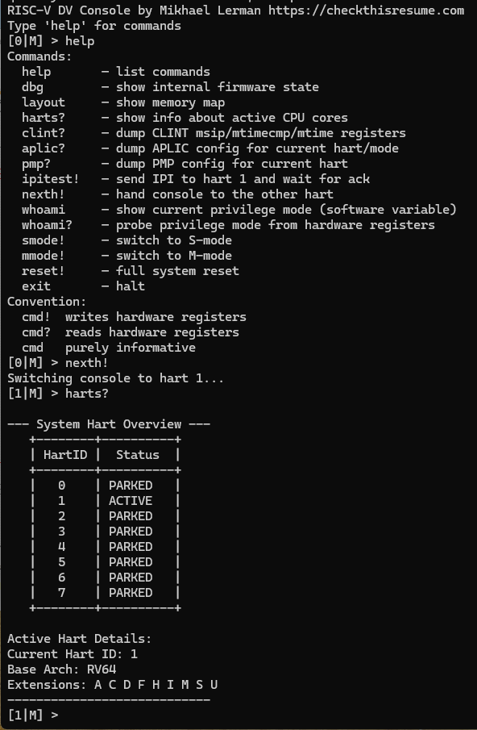

# RISC-V DV Console

A bare-metal RISC-V firmware implementing an interactive UART console with dynamic multi-hart support, privilege mode switching, and hardware introspection commands. Runs on QEMU's `virt` machine with AIA/APLIC interrupt architecture.



---

## Features

- **Interactive UART shell** — command dispatch, echo, line editing
- **Dynamic hart detection** — automatically detects the number of active harts at boot via a shared checkin array; works with `-smp 1` through `-smp 16` without source changes
- **Multi-hart console switching** — `nexth!` cycles the console ownership round-robin across all detected harts
- **Privilege mode switching** — `smode!` / `mmode!` switch between M-mode and S-mode
- **Hardware introspection** — inspect CLINT, APLIC, PMP registers and live hart state
- **Memory layout display** — shows firmware sections and per-hart stacks from linker symbols

---

## Hardware Target

| Parameter | Value |
|---|---|
| ISA | RISC-V RV64 (`rv64imac_zicsr`) |
| Machine | QEMU `virt` with `aia=aplic` |
| UART | NS16550 at `0x10000000` |
| M-APLIC | `0x0c000000` |
| S-APLIC | `0x0d000000` |
| CLINT | `0x02000000` |
| RAM | `0x80000000`, 128 MB |

---

## Building

```bash
# Requirements: riscv64-unknown-elf-gcc, qemu-system-riscv64

make          # build console.elf
make run      # run with QEMU (edit Makefile for -smp N)
make clean    # remove console.elf
```

To change the hart count, edit the `-smp N` value in the Makefile `run` target. No source changes or recompilation of any logic is needed — the firmware detects harts dynamically at boot.

> **Note:** `NUM_HARTS` in `smp.h` defines the compile-time maximum (stack allocation). It is currently set to 16. The runtime hart count is detected automatically and stored in `num_harts`.

---

## Commands

```
help       — list commands
dbg        — show internal firmware state (hart_present, hart_state, flags)
layout     — show memory map with section sizes and per-hart stacks
harts?     — show live hart status table and ISA details
clint?     — dump CLINT msip/mtimecmp/mtime registers (full 64-bit)
aplic?     — dump APLIC config for current hart and privilege mode
pmp?       — dump PMP configuration for current hart
ipitest!   — send IPI to hart 1 and verify acknowledgement
nexth!     — hand console to the next hart (round-robin)
whoami     — show current privilege mode (software variable)
whoami?    — probe privilege mode from hardware registers
smode!     — switch to S-mode
mmode!     — switch back to M-mode
reset!     — full system reset via QEMU test device
exit       — halt via QEMU test device

Convention:
  cmd!   writes hardware registers
  cmd?   reads hardware registers
  cmd    purely informative
```

---

## Architecture

### UART Interrupt Ownership
Hart 0 permanently owns M-APLIC IRQ 10 (UART). All harts — regardless of privilege mode or which owns the console — read received bytes from a shared ring buffer (`rx_buf`) via `uart_getc()`. When parked, hart 0 continues handling UART RX interrupts and forwarding bytes to the buffer.

### Hart Detection
At boot, each secondary hart writes `hart_present[mhartid] = 1` before entering its park loop. Hart 0 polls this array until stable (no new check-ins for 1M cycles), then stores the result in `num_harts`. This drives `harts?`, `nexth!`, `clint?`, and `layout` at runtime.

### Prompt Format
```
[hartID|mode] >    e.g.  [0|M] >  [1|S] >  [3|M] >
```

### Privilege Mode Switching
`mmode!` from S-mode uses `ecall` → M-mode trap handler → sets `ecall_pending` → `mret` back to M-mode. `smode!` uses `mret` with `MPP=S`. Mode switches are currently fully supported only on hart 0 (see Known Limitations).

---

## File Map

| File | Role |
|---|---|
| `start.S` | Boot, trap trampolines, mode switch routines, per-hart park loops |
| `main.c` | Shell, command dispatch, layout, CLINT/APLIC/PMP display, hart detection |
| `mode.c` | Mode switch logic, hart switch (`nexth!`), `harts?`, `whoami?` |
| `trap.c` | M/S trap handlers, RX ring buffer, IPI handlers |
| `aplic.c` | M-APLIC and S-APLIC initialization and IRQ claim |
| `uart.c` | NS16550 UART driver |
| `smp.h` | Shared SMP types: `NUM_HARTS`, `hart_state_t`, `console_hartid`, `hart_entry`, `num_harts` |
| `smp.c` | Shared SMP state definitions |
| `link.ld` | Memory layout, 16× per-hart stacks, section symbol exports |
| `Makefile` | Build and QEMU run targets |

---

## Known Limitations

### Mode switching only reliable on hart 0
`smode!`/`mmode!` from non-zero harts may lose UART RX. Root cause: `mideleg=0xffffffff` written by `switch_to_smode` on non-zero harts causes QEMU's APLIC to stop delivering UART interrupts to hart 0's IDC. Workaround: return to hart 0 with `nexth!` before switching modes.

### `nexth!` from S-mode only works once
After `smode! → nexth!`, the receiving hart inherits `current_mode=MODE_S` (global variable). Subsequent `nexth!` calls use stale mode state. Workaround: use `mmode!` before calling `nexth!` again.

---

## License

MIT, preserve header in source files, and opening banner in executables
